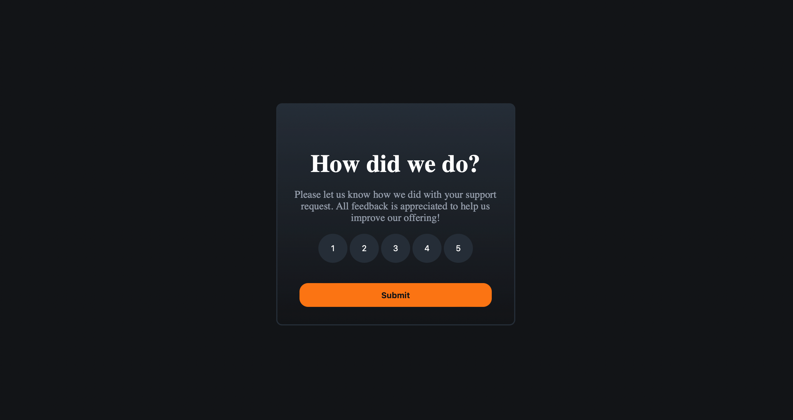

# Frontend Mentor - Rating & Rating Display Program

This is a solution to the [Interactive rating component challenge on Frontend Mentor](https://www.frontendmentor.io/challenges/interactive-rating-component-koxpeBUmI). Frontend Mentor challenges help you improve your coding skills by building realistic projects.

## Table of contents

- [Overview](#overview)
  - [The challenge](#the-challenge)
  - [Screenshot](#screenshot)
- [My process](#my-process)
  - [Built with](#built-with)
  - [What I learned](#what-i-learned)
  - [Continued development](#continued-development)
  - [Useful resources](#useful-resources)
- [Author](#author)
- [Acknowledgments](#acknowledgments)

## Overview

- Created an application for users to rate any given product, then also including a chart page to display the aggregated data so a user could see the generalized information.

### The challenge

Users should be able to:

- View the optimal layout for the app depending on their device's screen size
- See hover states for all interactive elements on the page
- Select and submit a number rating
- See the "Thank you" card state after submitting a rating

### Screenshot



### Links

- Solution URL: [Add solution URL here](https://github.com/SiahBatterson/frontend-mentor-rating/tree/main)
- Live Site URL: [Add live site URL here](https://siahbatterson.github.io/frontend-mentor-rating/)

## My process

- First I like to get CSS styling down. This helps me viisualize all the information on the page so I can imagine how the components will work together.
- After CSS Styling I like to add the debugging version of my CSS so I linked all the buttons together with console output.
- After this I added the ability for the rating to be stored.
- After this I tied up loose ends, added the finished page, and then looked up all thbe dynamic CSS styling things I was less familiar with the finish the site.
- Then I added the extra feature using chart.js to visualize a sample set of user ratings with its own HTML page.

### Built with

- Semantic HTML5 markup
- CSS custom properties
- Flexbox
- [Chart.js] (Used to aggregate and showcase data) - js library

### What I learned

Learned the value attribute of buttons:

```html
<button class="rating-button" value="1">1</button>
```

Also learned using nested psuedo classes to better control hover effects:

```css
.rating-button.active:hover {
  background-color: hsl(25, 97%, 53%);
  color: black;
}
```

Also was able to dyanmically force classes and active states for buttons to create better interactivity.

```js
const allButtons = document.querySelectorAll(".rating-button");
allButtons.forEach((button) => {
  button.addEventListener("click", function (ev) {
    current_rating = ev.target.value;
    allButtons.forEach((but) => {
      but.classList.remove("active");
    });
    button.classList.add("active");
    console.log(`user rated: ${current_rating}`);
  });
});
```

### Continued development

Storing data is a huge part of this project. The best future development would be enabling some sort of more exntended .json format that can store the data so chart.js can scale off that data and increase its usefullness.

### Useful resources

- [Creating elements in HTML](https://stackoverflow.com/questions/9422974/createelement-with-id) - This helped me insert an `` tag into my code.
- [Remove class in JS](https://stackoverflow.com/questions/10842471/how-to-remove-all-elements-of-a-certain-class-from-the-dom) - This helped me clear all the rating buttons.
- [InsertBefore] (https://stackoverflow.com/questions/618089/can-i-insert-elements-to-the-beginning-of-an-element-using-appendchild) - This helped me create better order for the HTML when inserting elements into the DOM via JS.
- [Create Element] (https://stackoverflow.com/questions/7802744/adding-an-img-element-to-a-div-with-javascript) - More inserting element help.
- [Value attribute in JS] (https://www.w3schools.com/tags/att_button_value.asp) - Learning about the value attribute to help with ratings.
- [Inserting the font used int he project] (https://www.w3schools.com/css/css3_fonts.asp) - How to insert web based fonts into a project.

## Author

- Website - [Josiah Batterson](https://github.com/SiahBatterson/)
